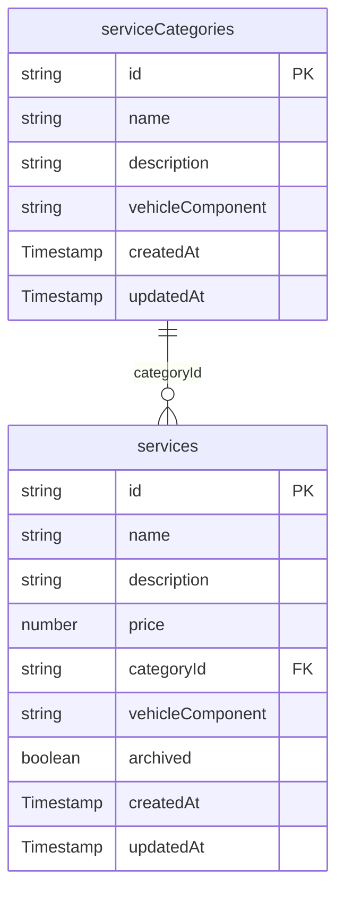

# Feature #18 — Справочник услуг: Architecture Document

## ADR-18-01: Top-level Firestore Collections vs. Subcollections

**Status:** Accepted

**Context:**
Services need to be queried independently of their category — for example, when linking a service
to a work order (feature #21). A subcollection design (`serviceCategories/{id}/services/{id}`)
would require knowing the category ID before querying services, making cross-category queries
impossible without Collection Group queries.

**Decision:**
Use two **top-level** Firestore collections: `serviceCategories` and `services`.
`services/{id}.categoryId` holds a reference (string ID) back to `serviceCategories/{id}`.

**Consequences:**
- Services can be queried across all categories by any field (price, vehicleComponent, etc.)
- Category lookups require an extra read or a denormalized `categoryName` field — acceptable for MVP
- Deleting a category does not cascade; orphan services must be cleaned up via application logic

---

## ADR-18-02: Soft Delete (Archiving) for Services

**Status:** Accepted

**Context:**
Once a service is referenced in a completed work order, hard-deleting it destroys historical
accuracy. Order records must always be able to display the original service name and price.

**Decision:**
Services are **never hard-deleted**. Instead, `services/{id}.archived: boolean` is set to `true`.
By default all queries filter `where('archived', '==', false)`. Admin UI can toggle archiving
and optionally show archived services.

**Consequences:**
- Historical orders remain accurate
- Firestore index on `(archived, categoryId)` needed for filtered queries
- Categories can be hard-deleted when no non-archived services reference them

---

## ADR-18-03: vehicleComponent as Enum String (not a Sub-Collection)

**Status:** Accepted

**Decision:**
`vehicleComponent` is stored as a plain string enum value on both `serviceCategories` and
`services` documents. A dedicated collection is not warranted at this stage — values are stable
and known at build time. Client-side validation enforces the allowed set.

**Allowed values:** `engine | gearbox | suspension | brakes | electrics | tires | body | other`

---

## Data Model



### Field Details

| Collection          | Field              | Type      | Notes                                    |
|---------------------|--------------------|-----------|------------------------------------------|
| serviceCategories   | id                 | string    | Auto-generated Firestore doc ID          |
| serviceCategories   | name               | string    | Required, non-empty                      |
| serviceCategories   | description        | string    | Optional                                 |
| serviceCategories   | vehicleComponent   | string    | Enum — see allowed values above          |
| serviceCategories   | createdAt          | Timestamp | serverTimestamp() on create              |
| serviceCategories   | updatedAt          | Timestamp | serverTimestamp() on every write         |
| services            | id                 | string    | Auto-generated Firestore doc ID          |
| services            | name               | string    | Required, non-empty                      |
| services            | description        | string    | Optional                                 |
| services            | price              | number    | Required, >= 0                           |
| services            | categoryId         | string    | FK → serviceCategories/{id}              |
| services            | vehicleComponent   | string    | Enum, may differ from category           |
| services            | archived           | boolean   | Default false; true = soft-deleted       |
| services            | createdAt          | Timestamp | serverTimestamp() on create              |
| services            | updatedAt          | Timestamp | serverTimestamp() on every write         |

---

## Firestore Security Rules

```firestore-rules
// Add inside existing rules block alongside other collections

match /serviceCategories/{categoryId} {
  // Admin: full CRUD. Manager: read only. Others: no access.
  allow read: if request.auth != null
               && request.auth.token.role in ['admin', 'manager'];
  allow create, update, delete: if request.auth != null
                                  && request.auth.token.role == 'admin';
}

match /services/{serviceId} {
  // Admin: full CRUD. Manager: read only. Others: no access.
  allow read: if request.auth != null
               && request.auth.token.role in ['admin', 'manager'];
  allow create, update, delete: if request.auth != null
                                  && request.auth.token.role == 'admin';
}
```

---

## Service Layer Interface

File: `src/services/serviceCatalogService.js`

```js
// ── Category operations ──────────────────────────────────────────────────────

/**
 * @returns {Promise<CategoryDoc[]>}
 */
getCategories()

/**
 * @param {{ name: string, description?: string, vehicleComponent: string }} data
 * @returns {Promise<{ id: string }>}
 */
createCategory(data)

/**
 * @param {string} id
 * @param {{ name?: string, description?: string, vehicleComponent?: string }} data
 * @returns {Promise<void>}
 */
updateCategory(id, data)

/**
 * @param {string} id
 * @returns {Promise<void>}
 */
deleteCategory(id)

// ── Service operations ───────────────────────────────────────────────────────

/**
 * @param {{ categoryId?: string, vehicleComponent?: string, archived?: boolean }} filters
 * @returns {Promise<ServiceDoc[]>}
 */
getServices(filters)

/**
 * @param {{ name: string, description?: string, price: number,
 *           categoryId: string, vehicleComponent: string }} data
 * @returns {Promise<{ id: string }>}
 */
createService(data)

/**
 * @param {string} id
 * @param {Partial<ServiceDoc>} data
 * @returns {Promise<void>}
 */
updateService(id, data)

/**
 * @param {string} id
 * @param {boolean} archived
 * @returns {Promise<void>}
 */
archiveService(id, archived)
```

---

## Component Architecture

```
src/features/services/
├── CategoryList.jsx          — Table/list of categories; admin shows Edit/Delete actions
├── CategoryForm.jsx          — Create & edit form for a category (React Hook Form)
├── ServiceList.jsx           — Filtered list of services with search + category filter
├── ServiceForm.jsx           — Create & edit form for a service (React Hook Form)
├── ServiceCard.jsx           — Card view of a single service (name, price, badge)
└── VehicleComponentBadge.jsx — Coloured badge for vehicleComponent enum value

src/pages/dashboard/
└── ServicesPage.jsx          — Route page; composes CategoryList + ServiceList + modals

src/hooks/
└── useServiceCatalog.js      — All TanStack Query hooks for both collections

src/services/
└── serviceCatalogService.js  — Firestore CRUD — only file that imports Firestore SDK
```

### Component Responsibilities

| Component               | Role                                                                    |
|-------------------------|-------------------------------------------------------------------------|
| ServicesPage            | Layout, role gate, modal open/close state, filter state                 |
| CategoryList            | Renders category rows; dispatches open-modal events to ServicesPage     |
| CategoryForm            | Controlled by React Hook Form; calls useCreateCategory / useUpdateCategory |
| ServiceList             | Accepts filters prop; renders ServiceCard per item                      |
| ServiceForm             | Controlled by React Hook Form; calls useCreateService / useUpdateService |
| ServiceCard             | Pure display; receives service object, passes actions up via props      |
| VehicleComponentBadge   | Stateless — maps enum string to label + colour                         |

---

## State Management Design

```
Server state (TanStack Query)
  queryKey: ['serviceCategories']          → useCategories()
  queryKey: ['services', filters]          → useServices(filters)
  Mutations invalidate the relevant queryKey on success.

UI / local state (React useState in ServicesPage)
  showCategoryForm: boolean
  editCategory: CategoryDoc | null
  showServiceForm: boolean
  editService: ServiceDoc | null
  filters: { categoryId, vehicleComponent, showArchived }

No Zustand store needed — server cache lives in React Query;
UI state is page-local and does not need cross-component sharing.
```

---

## Security Considerations

1. **Firestore rules are the authoritative gate** — client-side role checks (hiding buttons, etc.)
   are UX only. Rules must reject unauthorised writes even if the UI is bypassed.
2. **Admin custom claim** (`request.auth.token.role`) is set server-side (Cloud Function or Admin
   SDK). Firestore rules must never trust Firestore `users/{uid}.role` alone for write gates.
3. **Price field** — validate `price >= 0` in both the form (React Hook Form `min: 0`) and in
   Firestore rules (`request.resource.data.price >= 0`).
4. **Archived filter** — default queries must include `where('archived', '==', false)` to prevent
   accidentally surfacing archived services in order-creation flows.

---

## Technical Risks

| Risk | Likelihood | Impact | Mitigation |
|------|-----------|--------|------------|
| Missing Firestore index for `(archived, categoryId)` query | High | Query fails silently in prod | Create composite index in Firestore console before deploy; add to `firestore.indexes.json` |
| Orphaned services after category hard-delete | Medium | Data inconsistency | Validate in deleteCategory — block delete if active services reference the category |
| Custom claim not propagated on token refresh | Low | Manager sees 403 errors | Force token refresh after role change; document in onboarding |
| Price stored as float precision error | Low | Incorrect totals | Store price in minor currency units (kopeks) in future; for MVP accept float |
